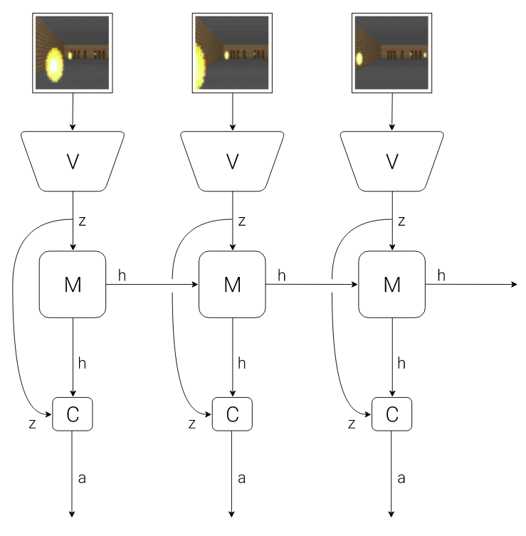
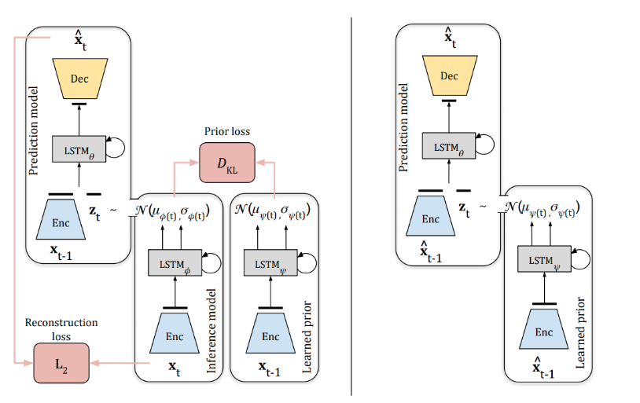
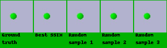
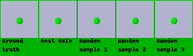
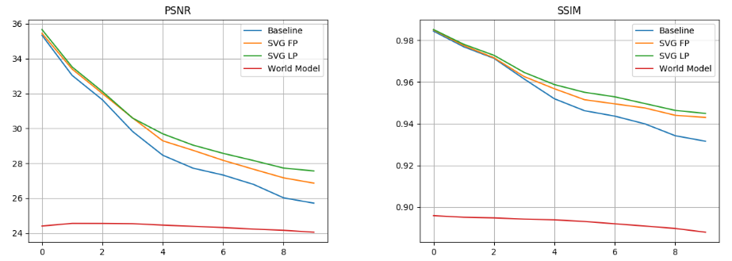

# Visual Transition Models
This project includes implementation of generative models for action-based video frame prediction. I originally used apply them to data from laparoscopic surgeries in scope of my Masterthesis. .  

# Data preparation

The data is therefore omitted and the old instructions are moved [here.](data_preprocessing/README.md)
It is possible to generate a synthetic dataset using pybullet, more details are to be found in  [simulator/README.md](simulator/README.md)


# World models

The first model to train is the World Model from [1], it consits from two parts: Variational Autoncoder and a Mixture desnity RNN. 
## About the model
World Models is a generative neural network developed to learn a spatio-temporal representation of the environment. The authors compare the concept with the way how humans develop  their  own  internal  environment  model  which  is  limited  to  human  sensors  and memory capacity, but it represents the concepts and relationships in the world sufficiently enough.  Our brains are able to learn spatial and temporal aspects and based on an internal model make predictions of the future. The world model consist of three components: (i) the Vision Model (V), (ii) the MemoryRNN (M) and (iii) the Controller (C) as depicted in Figure 1.  The Vision and Memory model together shape the environment model which we will implement.

1. Vision Model (V) - VAE
The role of the Vision Model is to learn a compact representation of the high dimensional data. It receives as input the frame at current time stept and then samples a latent vector *z_t*. The model is trained and evaluated by using only the latent vector, but it is possible to reconstruct the current or predicted frame using the decoder part of the trained VAE.

2. Memory Model (M) - MDN-RNN
While the VAE models the spatial relations, the Memory Model learns the temporal relations.  The model consists of two components:  first one is the LSTM recurrent neural network and second is a Mixture Density Network. By combining them together it is achieved that the future latent variable vector *z_(t+1)* is sampled from a Mixture of Gaus-sians instead of having a deterministic value e.g.  the MDN-RNN models the probability density function of the next latent vector *z_(t+1)*.
3. Controller (C) Model 
The Controller (C) is principally the policy that the agent learns. As I was developing only the environment model, the controller is not used in this project.



Figure 1. World Models architecture

## Training

The models are trained separately, but they have to be stored in the same directory (`logdir` paramaters in params file): 

```bash
python worldmodels/train_vae.py --params params/vae_train_params.yaml 
```

After training the VAE, next is the MD-RNN:
```bash
python worldmodels/train_mdrnn.py --params params/mdrnn_train_params.yaml 
```
The evaluation is performed with:
```bash
python worldmodels/eval_mdrnn.py --params params/eval_wm.yaml 
```


# Stochastic Video Generation
There are three models: SVG with Learned Prior, SVG with Fixed Prior and the Baseline. The models exact differnce between models is explained in the papers referenced in the of this document. The paramaters vary slightly, therefore one example is given on how to train the SVG-LP.


Figure 2.  SVG-LP at training (left) and inference time (right)


```bash
python svg_models/train_svg_lp.py --params params/.yaml 
```

All evaluations measure mean SSIM and PSNR on validation data and also generate GIF examples of rollout predictions.#

```bash
python svg_models/eval_svg_lp.py --params params/svg_lp_eval_params.yaml 
```

# Results
The SVG-LP model shows superior performance in situation where there is stochasticity involved e.g. when there are many different futures, it can predict them and choose the correct. On the example below in contrast to SVG-LP, the baseline learned one outcome - in every case it predicts that the object will exit the view space.  The green frames are inputed frames and the blue frames are predicted frames.  


Figure 3. Baseline prediction



Figure 4. SVG-LP prediction


Figure 5. Quantitative evaluation of the video prediction models

# References

For this project the next publications and Github repositories have been used:

* World Models
    * [1] David Ha and Jürgen Schmidhuber. Recurrent world models facilitate
policy evolution, 2018. 
[link](http://papers.nips.cc/paper/7512-recurrent-world-models-facilitate-policy-evolution.pdf)  
    * Github [code](https://github.com/ctallec/world-models)
    
* Stochastic Video Generation 
    * [2] Emily Denton and Rob Fergus. Stochastic video generation with a learned prior, 2018. 
[link](https://arxiv.org/pdf/1802.07687.pdf) 
    * Github [code](https://github.com/edenton/svg)
    
* Variational Autoencoders
    * [3] Diederik P Kingma and Max Welling. Auto-encoding variational bayes, 2013. [link](https://arxiv.org/abs/1312.6114)
    * Github [code](https://github.com/bhpfelix/Variational-Autoencoder-PyTorch)
    
* Differentiable Multi-Scale Structural Similarity (SSIM) index
    * Github [code](https://github.com/jorge-pessoa/pytorch-msssim)


